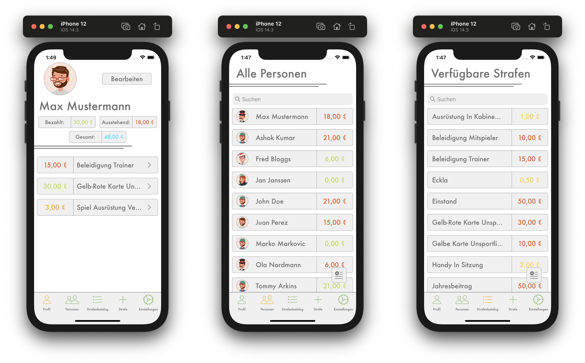
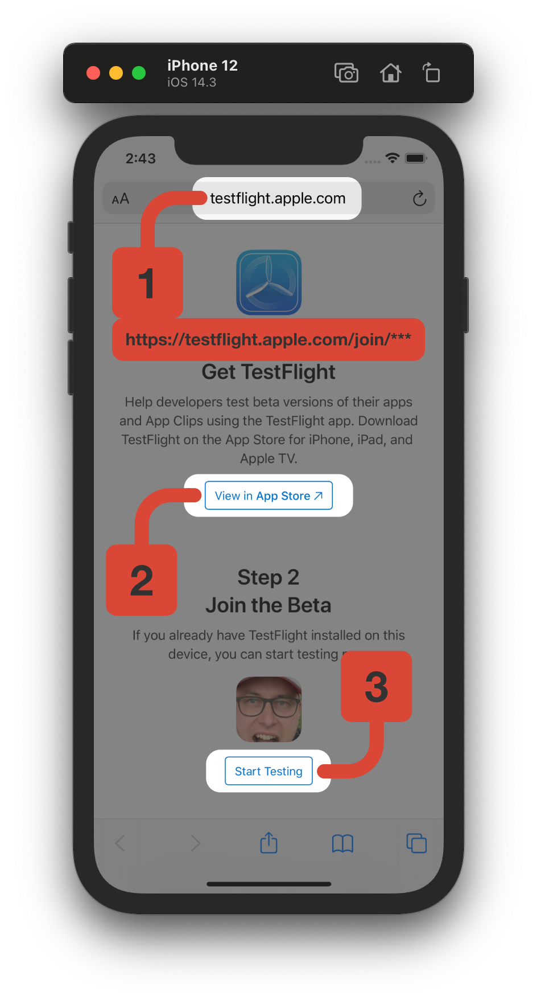
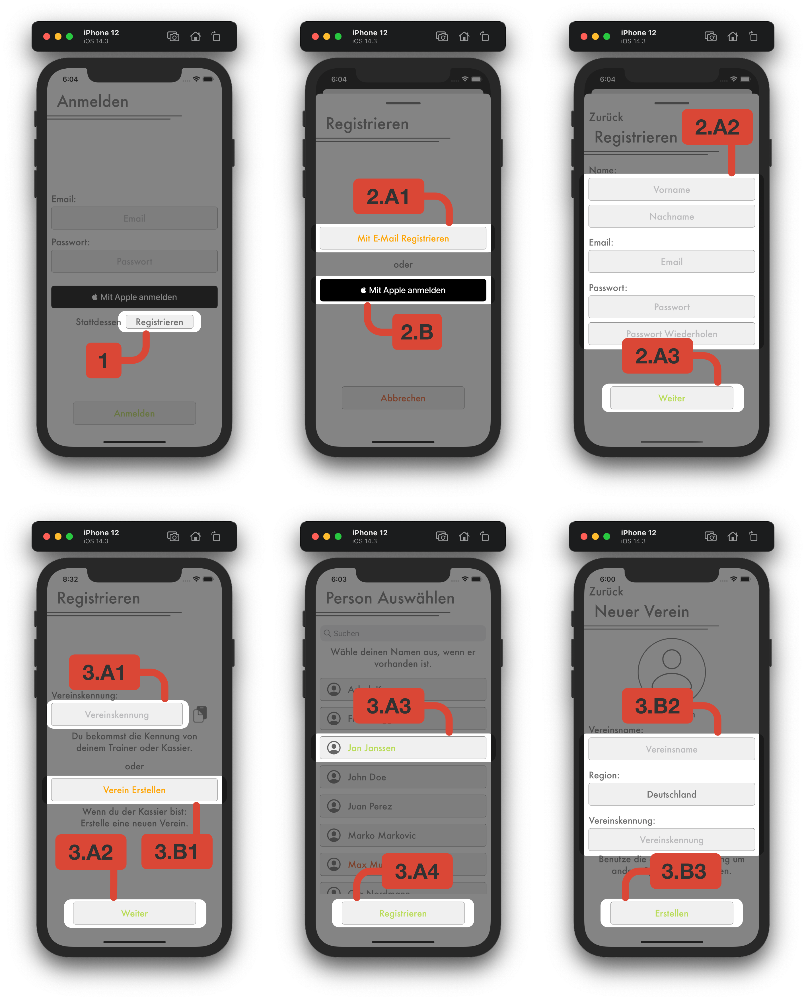
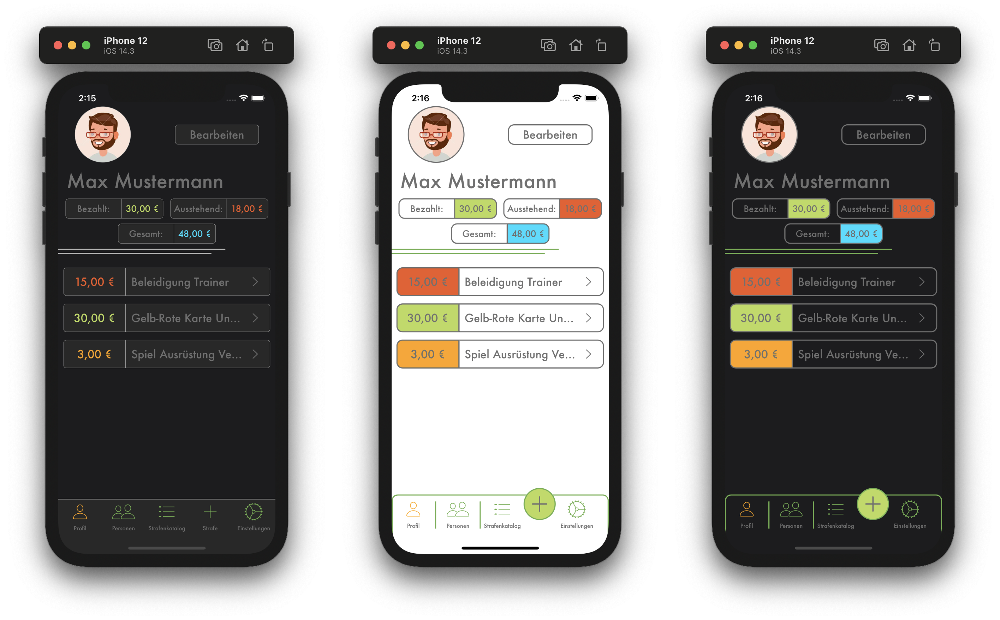

# Strafen App
This repo is used to create an app for iOS 14+ which can be used to display the penalty catalog and all given fines of a football team, etc.

 
-- for german version see below - für deutsche Version weiter unten schauen -- 
  

## Table of Contents
- [Strafen App](#strafen-app)
  - [Table of Contents](#table-of-contents)
  - [Requirement](#requirement)
  - [Installation](#installation)
  - [First Steps](#first-steps)
  - [Bug Report and Feature Request](#bug-report-and-feature-request)
  - [Notes](#notes)
    - [Widgets](#widgets)
    - [Style and Appereance](#style-and-appereance)
- [Strafen App](#strafen-app-1)
  - [Voraussetzungen](#voraussetzungen)
  - [Installation](#installation-1)
  - [Erste Schritte](#erste-schritte)
  - [Fehlerbericht und Featureanfrage](#fehlerbericht-und-featureanfrage)
  - [Sonstiges](#sonstiges)
    - [Widgets](#widgets-1)
    - [Design and Aussehen](#design-and-aussehen)

## Requirement
- For app installation (one of the possibilities):
  + iOS 14.0+
  + iOS 14.0+ beta:\
    Load profile from [Apple Beta Website](https://beta.apple.com/sp/de/betaprogram/guide#ios) and follow the steps described.
- For development: 
  + XCode 12+ with Swift 5.3+

## Installation
- For app installation:
  + From AppStore (not available yet)
  + For beta-testing (see image below): 
    1. Install [TestFlight](https://itunes.apple.com/de/app/testflight/id899247664?mt=8) on your iOS device that you will be using for testing.
    2. Open the invitation email or tap the public link on your iOS device (write to me for the public link).
    3. Tap on “Show in TestFlight” or “Start test”, or tap on "Install" or "Update" for the Strafen app.
- For development:
  + Clone this repository

  
## First Steps
1. <b style="color: #DA4736;">See images below.</b> The first time you use the app, you will need to sign up with either your email or Apple. To do this, click on `Registrieren` <b style="color: #DA4736;">1.</b> and then on the desired option. 
    - When registering by email <b style="color: #DA4736;">2.A1</b>, you must enter your name, your email address and a password <b style="color: #DA4736;">2.A2</b>. There are some restrictions on the password:
       * Password must contain at least 8 characters 
       * Password must contain a uppercase letter
       * Password must contain a lowercase letter
       * Password must contain a number

      After clicking `Weiter` <b style="color: #DA4736;">2.A3</b>, an email with a registration code will be sent to your email address. This can take a while, also look in the spam folder. You have 30 days to verify your email. After that, you cannot use the app until you have confirmed your email.
    - When registering with Apple <b style="color: #DA4736;">2.B</b> a full name must be provided.
2. Then two options will appear: Use the first one with the club identifier if you are a team member <b style="color: #DA4736;">3.A1</b>. Use the `Verein Erstellen` <b style="color: #DA4736;">3.B1</b> button if you are a cashier and want to create a new team in this app.
    - You get the club identifier from your cashier <b style="color: #DA4736;">3.A1</b>. If not, the cashier or another member of your team can get it through the app's settings. Then simply click the `Weiter` <b style="color: #DA4736;">3.A2</b> button.
    - If you are the cashier of your team, you can use the `Verein Erstellen` <b style="color: #DA4736;">3.B1</b> button to create a new team. Only one member of your team can use this option (mostly the cashier, possibly the trainer).
3. After joining a team with the club identifier, you need to choose your person <b style="color: #DA4736;">3.A3</b>. If you are not listed, simply click on `Registrieren` <b style="color: #DA4736;">3.A4</b>.

   If you are the cashier you will need to choose a team name and possibly a team picture <b style="color: #DA4736;">3.B2</b>. You can create your team's identifier to share with your teammates. The club identifier will later also be visible in the settings section. Add a region to get the correct currency. After that click `Erstellen` button <b style="color: #DA4736;">3.B3</b>.

## Bug Report and Feature Request
- To report a bug of the app, you can use the Feedback option in TestFlight or create a new issue under [Github Issues](https://github.com/stevenkellner/strafen/issues).
- To request a new feature, also create a new issue under [Github Issues](https://github.com/stevenkellner/strafen/issues).
    * If you create an issue with Github Issues please select the `Strafen App` project.
    
## Notes
### Widgets
- This app also supports the new iOS 14 widgets for lock screen and home screen in all three different sizes (small / medium / large). These widgets are used to show the total of your paid and unpaid fines. The medium and large widgets also show details about any your fines.

### Style and Appereance
- The app also supports a dark mode and a differnt style.
  

 

***

 
-- german version - deutsche Version --
  

# Strafen App
Diese Repo wird genutzt um eine App für iOS 14+ zu bauen, welche den Strafenkatalog und alle vergebenen Strafen eines Fußballteams, usw. anzeigt.

## Voraussetzungen
- Für die App Installation (Eine der Möglichkeiten):
  + iOS 14+
  + iOS 14+ beta:\
    Lade das Profil von der [Apple Beta Webseite](https://beta.apple.com/sp/de/betaprogram/guide?locale=de#ios) und befolge die beschriebenen Schritte.
- Für die Entwicklung:
  + XCode 12+ with Swift 5.3+

## Installation
- Für die App Installation:
  + Vom AppStore (noch nicht verfügbar)
  + Für Beta-Tests (Bild unten):
    1. Installiere [TestFlight](https://itunes.apple.com/de/app/testflight/id899247664?mt=8) auf deinem iOS‑Gerät, das du zum Testen verwenden wirst.
    2. Öffne die Einladungs‑E‑Mail oder tippe auf deinem iOS‑Gerät auf den öffentlichen Link (Schreib mich für den öffentlich an).
    3. Tippe auf „In TestFlight anzeigen“ oder „Test starten“, oder tippe auf „Installieren“ oder „Update“ für die Strafen App.
- Für die Entwicklung:
  + Clone das Repository
  

## Erste Schritte
1. <b style="color: #DA4736;">Siehe Bilder unten.</b> Wenn du die App das erste Mal benutzt, musst du dich entweder mit deiner E-Mail oder mit Apple registrieren. Um dies zu tuen, klicke auf `Registieren` <b style="color: #DA4736;">1.</b> und dann auf die gewünschte Option.
    - Bei der Registrierung mit E-Mail <b style="color: #DA4736;">2.A1</b> muss dein Name, deine E-Mail Addresse und ein Passwort eingegeben werden <b style="color: #DA4736;">2.A2</b>. Für das Passwort mussen bestimmte Anforderungen erfüllt werden:
       * Das Passwort muss mindestens 8 Zeichen enthalten
       * Das Passwort muss einen Großbuchstaben enthalten
       * Das Passwort muss einen Kleinbuchstaben enthalten
       * Das Passwort muss ein Zahl enthalten 
      
      Nachdem du auf `Weiter` <b style="color: #DA4736;">2.A3</b> klickst, wird eine E-Mail mit einem Bestätigungscode an deine E-Mail Address gesendet. Dies kann eine Weile dauern, schauen Sie auch im Spam-Ordner nach. Du hast 30 Tage Zeit deine E-Mail zu bestätigen, danach kannst du die App nur nutzen bis du die E-Mail bestätigt hast.
    - Bei der Registrierung mit Apple <b style="color: #DA4736;">2.B</b> muss ein vollständiger Name angegeben werden.
2. Danach erscheinen zwei Möglichkeiten: Benutze die erste mit dem Vereinscode, wenn du ein Teammitglied bist <b style="color: #DA4736;">3.A1</b>. Benutze den `Verein Erstellen` <b style="color: #DA4736;">3.B1</b> Knopf, wenn du der Kassier bist und du einen neuen Verein für die App erstellen willst.
    - Du bekommst die Vereinskennung von deinem Kassier <b style="color: #DA4736;">3.A1</b>. Wenn nicht, der Kassier oder ein anderes Mitglied deines Teams kann den Code von den App-Einstellungen. Dann drücke einfach auf den `Weiter` <b style="color: #DA4736;">3.A2</b> Knopf.
    - Wenn du der Kassier deines Vereins bist, kannst du mit dem `Verein Erstellen` <b style="color: #DA4736;">3.B1</b> Knopf ein neues Team erstellen. Nur ein Mitglied deines Vereins kann diese Option nutzen (meistens der Kassier, vielleicht der Trainer). 
3. Nachdem du einem Verein mit der Vereinskennung beigetreten bist, musst du deine Person auswählen <b style="color: #DA4736;">3.A3</b>. Wenn du nicht aufgeführt bist, drück einfach auf `Registrieren` <b style="color: #DA4736;">3.A4</b>.

   Wenn du der Kassier bist, musst du jetzt nur noch einen Vereinsnamen auswählen <b style="color: #DA4736;">3.B2</b>, du kannst auch ein Bild wählen. Du kannst die Vereinskennung erstellen, um ihn mit deinen Teamkollegen teilen. Die Kennung wird auch später im Einstellungen-Bereich der App angezeigt. Gib eine Region an, um die richtige Währung einzustellen. Dannach drücke den `Erstellen` Knopf <b style="color: #DA4736;">3.B3</b>.
   

## Fehlerbericht und Featureanfrage
- Um einen Fehler der App zu melden, kannst du die Feedback Option in TestFlight benutzen oder erstelle einen neuen Issue in [Github Issues](https://github.com/stevenkellner/strafen/issues).
- Um eine neue Feature anzuforden, kannst du ebenfalls einen neuen Issue in [Github Issues](https://github.com/stevenkellner/strafen/issues) erstellen.
    * Wenn du ein Problem unter bei Gihub Issues erstellst, wähle `Strafen App` unter Projects aus.
    
## Sonstiges
### Widgets
- Die App unterstützt ebenfalls die neuen iOS 14 Widgets für den Start- und Sperrbildschirm in allen drei verschiedenen Größen (klein / mittel / groß). Diese Widgets zeigen deine gesamten gezahlten und ausstehenden Strafen. Die mittleren und großen Widgets zeigen sogar Details zu all deinen Strafen.

### Design and Aussehen
- Die App unterstützt außerdem Dunkelmodus und ein anderes Design.
  
